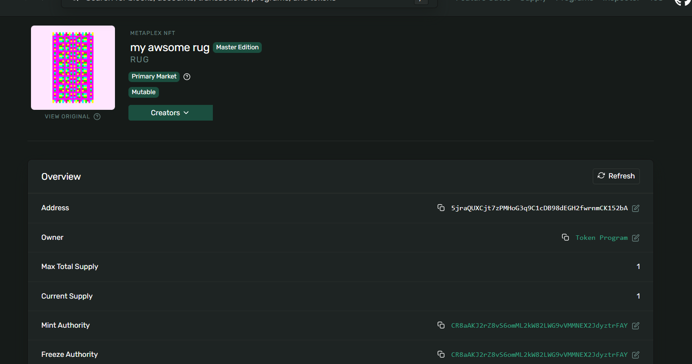

**Purpose**

This README documents the changes made to the SPL and NFT (Mint and swap) scripts and how to run the Devnet check tool.

**Assignment Tasks (Week 2)**

1. Mint an NFT (Devnet)
	- Create and mint a simple NFT with an image and metadata.
	- Use the image upload flow in `ts/cluster1/nft_image.ts`, then generate metadata with `ts/cluster1/nft_metadata.ts`, and mint with `ts/cluster1/nft_mint.ts`.

2. Trade the NFT
	- Swap the NFT with another person on Devnet (coordinate in Discord).
	- Exchange mint addresses and wallet public keys, then transfer the NFT and agreed payment.

3. Reflect on the process
	- Problems/limitations:
	  - Manual swaps are trust-based and not atomic.
	  - Metadata can be mutable if the update authority remains active.
	  - Off-chain hosting can be fragile if assets are not pinned.
	  - Devnet behavior differs from mainnet and can be unreliable.
	- Proposed solutions:
	  - Use an on-chain escrow/swap program for atomic trades.
	  - Lock metadata (or move update authority to multisig).
	  - Store assets on Arweave/IPFS and use immutable URIs.
	  - Re-test on mainnet with audited tooling before real value trades.

**Final Assignment Output**

Below is a screenshot of the final assignment output (example Metaplex page on Devnet). I added a placeholder SVG at `ts/assets/final_output.svg` so the image renders in the repo. Replace it with your real screenshot if you prefer a PNG.



Caption: Example Metaplex NFT page on Devnet showing a minted NFT, mint address, supply, and authorities. Replace `ts/assets/output.png` with your actual screenshot if desired.

**What I Changed / Inspected**

- `ts/cluster1/spl_init.ts` — initialization helper for SPL token program usage (sets up token minting environment).
- `ts/cluster1/spl_mint.ts` — mints SPL tokens; used as a reference for token mint flows in the project.
- `ts/cluster1/spl_transfer.ts` — transfers SPL tokens between accounts.
- `ts/cluster1/spl_metadata.ts` — helper to create or update SPL token metadata where applicable.
- `ts/cluster1/nft_image.ts` — uploads a local image to Irýs and prints the returned URI (used as the NFT image upload step).
- `ts/cluster1/nft_metadata.ts` — prepares/creates the NFT metadata JSON that points to the uploaded image URI.
- `ts/cluster1/nft_mint.ts` — mints the NFT on Devnet using the metadata and signer.
- `ts/tools/check_nfts.ts` — new tool: lists token accounts for a wallet on Devnet and prints Metaplex metadata for candidate NFT mints.

**How to Check Your Wallet (Devnet)**

Run the check script with your public key (example uses your key):

```bash
npx ts-node ts/tools/check_nfts.ts 7YvBgi2XRxhh1TzqRcCwnggEJ1EXFsDk3tEGrWaVvd6g
```

The script connects to https://api.devnet.solana.com, lists SPL token accounts that look like NFTs (amount 1, decimals 0), and attempts to fetch and print Metaplex metadata (name, symbol, URI, update authority).

**How to Upload / Swap an Image (existing flow)**

The upload script is `ts/cluster1/nft_image.ts`. By default it reads `./generug.png` relative to the `ts/` folder. To swap the rug image:

- Place your image at `ts/generug.png` and run:

```bash
npx ts-node ts/cluster1/nft_image.ts
```

- Or (future) run with an explicit `IMAGE_PATH` env var if `nft_image.ts` is updated to accept it.

**Updating NFT Metadata On‑Chain (Devnet)**

If you control the NFT's update authority you can update its metadata to point to the new image/JSON URI. Workflow:

1. Upload new image with `nft_image.ts` and copy the returned URI.
2. Run a metadata update script to set the NFT metadata `uri` to the new JSON location (I can add this script if you provide the mint address and confirm update authority).

**Next Steps I Can Do**

- Add a metadata update script (`update-metadata`) that updates the NFT `uri` on Devnet (requires mint and confirmation you control the update authority).
- Modify `ts/cluster1/nft_image.ts` to accept an `IMAGE_PATH` env/arg and create a small placeholder if the image is missing.

Tell me which next step you want: "update metadata" (include mint) or "accept IMAGE_PATH".
